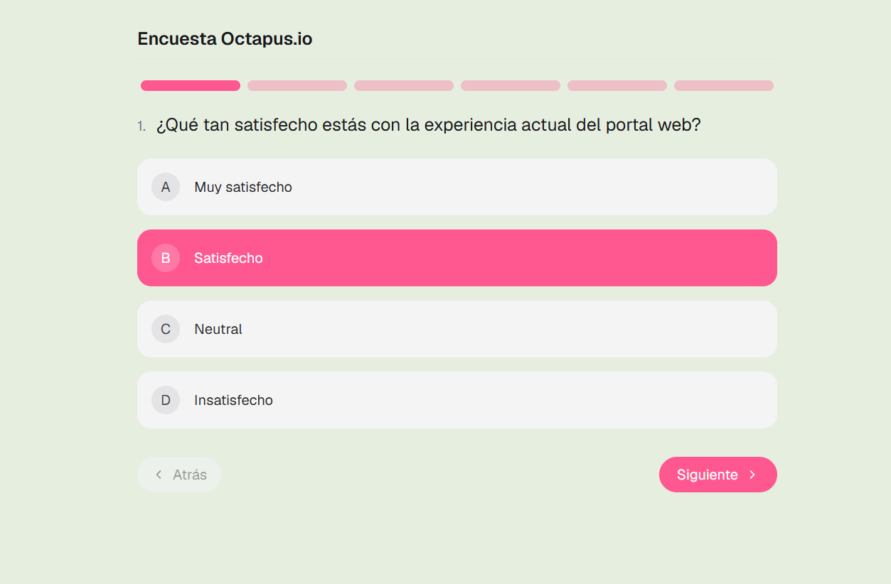

# Encuesta Octapus.io

Encuesta de opinión sobre el portal web de Octapus.io, construida con Next.js (App Router) y Tailwind CSS. Las preguntas se cargan desde un archivo JSON, las respuestas se almacenan en el servidor y los resultados se visualizan con gráficas interactivas.



## Características

- Encuesta multipaso con barra de progreso
- Prevención de respuestas duplicadas vía `localStorage`
- Almacenamiento de respuestas en `data/respuestas.json` con ID único por entrada
- Página de resultados con gráfica de barras y gráfica de torta por pregunta (Recharts)
- Fuente Geist (misma que shadcn/ui) y diseño responsivo

## Estructura

```plaintext
app/
├── page.js                  # Flujo principal de la encuesta
├── layout.js                # Fuente, metadata y favicon
├── globals.css              # Variables de color y tipografía
├── api/
│   └── respuestas/
│       └── route.js         # POST: guarda respuesta en data/respuestas.json
└── resultados/
    └── page.js              # Página de resultados con gráficas

components/
├── QuizSummary.js           # Pantalla de agradecimiento al finalizar
└── GraficasResultados.js    # Gráficas de barras y torta (Recharts)

data/
└── respuestas.json          # Respuestas acumuladas (generado automáticamente)

quiz.json                    # Preguntas y opciones de la encuesta
```

## Ejecutar

```bash
npm install
npm run dev
# Encuesta:    http://localhost:3000
# Resultados:  http://localhost:3000/resultados
```
